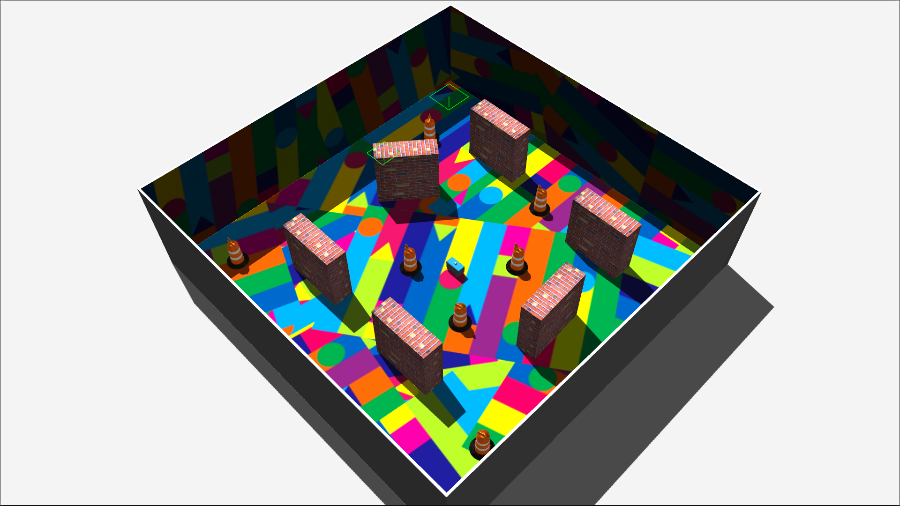
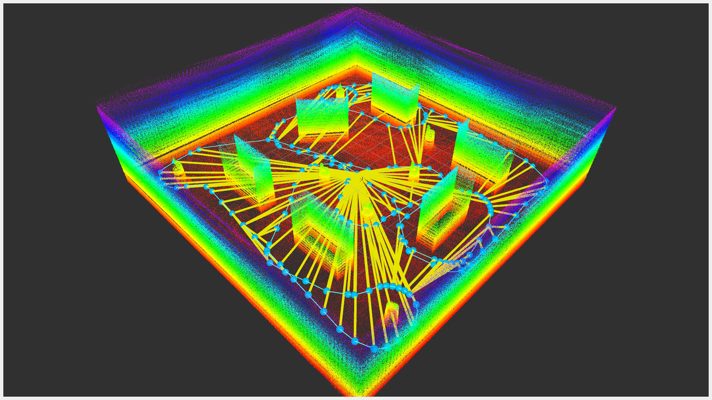
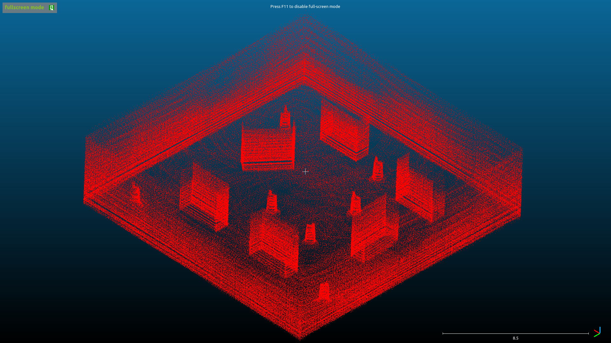

# LIO-SAM-Robot

ROS 2 Packages for Testing LIO-SAM on a Robotic Vehicle with 3D LIDAR and 9-Axis IMU.

|  |  |  |
|:--------:|:--------:|:--------:|
| Robot Simulation (Gazebo) | Real-Time Data Visualization (RViz) | Saved PCD Map Visualization & Post-Processing (CloudCompare) |

## Dependencies

- [ROS2](https://docs.ros.org/en/foxy/Installation.html) (Tested with ROS 2 Foxy Desktop Install)
  ```bash
  sudo apt install ros-$ROS_DISTRO-perception-pcl \
		   ros-$ROS_DISTRO-pcl-msgs \
		   ros-$ROS_DISTRO-vision-opencv \
		   ros-$ROS_DISTRO-xacro
  ```
- [gtsam](https://gtsam.org/get_started) (Georgia Tech Smoothing and Mapping Library)
  ```bash
  sudo add-apt-repository ppa:borglab/gtsam-release-4.1
  sudo apt install libgtsam-dev libgtsam-unstable-dev
  ```

## Install

  ```
  cd ~/ROS2_WS/src
  git clone https://github.com/Tinker-Twins/LIO-SAM-Robot.git
  cd ..
  colcon build
  ```

## Execute

1. Launch simulation:
```
ros2 launch robot_gazebo robot_sim.launch.py
```

2. Run the teleoperation node:
```
ros2 run teleop_twist_keyboard teleop_twist_keyboard
```
**Note:** To use joystick teleoperation, **uncomment** the final lines from `robot_sim.launch.py` and **do NOT** execute `teleop_twist_keyboard`
```
# Node(
# package = "joy",
# executable = "joy_node"
# ),
# IncludeLaunchDescription(
#     PythonLaunchDescriptionSource(
#         os.path.join(pkg_cart_pole_control, 'launch', 'robot_control.launch.py')
#     ),
# ),
```

3. Launch LIO-SAM node:
```
ros2 launch lio_sam run.launch.py
```
**Note:** Teleoperate the robot around the environment until a satisfactory map is built.

4. Save the PCD map:
```
ros2 service call /lio_sam/save_map lio_sam/srv/SaveMap
# OR
ros2 service call /lio_sam/save_map lio_sam/srv/SaveMap "{resolution: 0.2 destination: /Documents/PCD_Map}"
```
